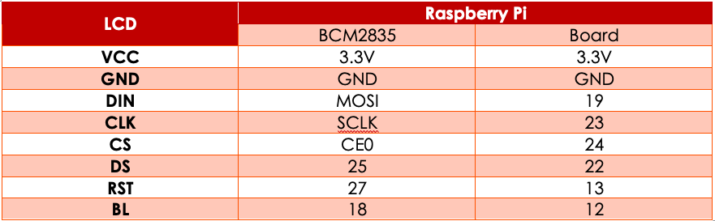
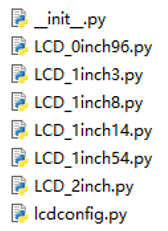

# 1.8 inch LCD Module
 
## ΕΙΣΑΓΩΓΗ
Στο παρόν αρχείο περιγράφονται τα βήματα που πρέπει να ακολουθηθούν για να ενεργοποιηθεί η οθόνη αλλά και να χρησιμοποιηθεί.

### ΧΑΡΑΚΤΗΡΙΣΤΙΚΑ
-	Τάση Λειτουργίας: 3.3V/5V (Όταν χρησιμοποιούνται τα 5V, το λογικό "1" είναι τα 5V, ενώ για τάση λειτουργίας 3.3V, το λογικό "1" είναι τα 3.3V)
-	Διεπαφή: SPI
-	Τύπος LCD: TFT
-	Οδηγός: ST7735S
-	Ανάλυση: 128 x 160 (Pixel)
-	Μέγεθος Οθόνης: 35.04mm(Πλάτος) x 28.03mm(Ύψος)
-	Μέγεθος Εικονοστοιχείου: 0.219mm(Πλάτος) * 0.219xx(Ύψος)
-	Διαστάσεις: 56.5mm x 34mm

## ΔΙΕΠΑΦΗ

### RASPBERRY PI :: ΣΥΝΔΕΣΕΙΣ
Συνδέστε την οθόνη με το Raspberry Pi σύμφωνα με τον ακόλουθο πίνακα.\
Περιγράφονται δύο τρόποι σύνδεσης ανάλογα με το αν το πρόγραμμα χρησιμοποιεί τη την απεικόνιση BCM2835 ή την κλασική (Board).

 

> Οι τρόποι απεικόνισης των pin του Raspberry Pi αναθέτουν δε κάθε pin έναν αριθμό ή ένα όνομα.
 
## RASPBERRY PI :: ΛΕΙΤΟΥΡΓΙΑ

### ΕΝΕΡΓΟΠΟΙΗΣΗ SPI INTERFACE

1.	Στη γραμμή ενοτλών πληκτρολογείστε\
**`sudo raspi-config`**
2.	Επιλέξτε διαδοχικά: **Interfacing Options -> SPI -> Yes to enable SPI interface**
3.	Επνακκινήστε το Raspberry Pi

### ΜΕΤΑΦΟΡΤΩΣΗ ΠΑΡΑΔΕΙΓΜΑΤΩΝ
Από τη διεύθυνση 

https://files.waveshare.com/upload/8/8d/LCD_Module_RPI_code.zip

μεταφορτώστε τα παραδείγματα και αποσυμπιέστε τα.

Μέσα στον φάκελο υπάρχουν τα ακόλουθα αρχεία

### ΕΛΕΓΧΟΣ ΛΕΙΤΟΥΡΓΙΑΣ 
Για να ελεγχθεί η σωστή εγκατάσταση και λειτουργία της οθόνης θα πρέπει διαδοχικά να εκτελέσετε τα ακόλουθα προγράμματα και να πάρετε ένδειξη σωστής λειτουργίας.
1. `lcdconfig.py`
2. `LCD_1inch8.py`

### ΣΥΝΑΡΤΗΣΕΙΣ ΟΘΟΝΗΣ

#### Προσανατολισμός Οθόνης

Αν θέλετε να αλλάξετε τον προσανατολισμό της οθόνης, χρησιμοποιήστε την εντολή\
**`im_r= image1.rotate(270)`** \
για να στρεφεί η οθόνη κατά 270°.\
Οι δυνατές τιμές είναι: 0°, 90°, 180°, 270°
 
#### Συναρτήσεις Γραφικών (GUI Functions)

Η βιβλιοθήκη γραφικών που χρησιμοποιεί η οθόνη είναι η PIL.\
Αν δεν είναι εγκατεστημένη, πληκτρολογείστε

**`sudo apt-get install python3-pil`**

#### Δομή Προγράμματος

***Εισαγωγή Βιβλιοθήκης***

Μέσα στο πρόγραμμα θα πρέπει να εισάγουμε τη βιβλιοθήκη

**`from PIL import Image,ImageDraw,ImageFont `**

Όπου, 
- `Image`, η βασική βιβλιοθήκη
- `ImageDraw`, η συνάρτηση σχεδίασης
- `ImageFont`, η συνάρτηση κειμένου. 

***Αντικείμενο Εικόνας***

Πρώτα δημιουργούμε το αντικείμενο που θα περιέχει αυτό που θέλουμε να εμφανιστεί στην οθόνη.

**`image1 = Image.new("RGB", (disp.width, disp.height), "WHITE") `**

Όπου

- "RGB": ο χρωματικός κώδικας που θα χρησιμοποιηθεί. 
- (disp.width, disp.height): Οι διαστάσεις της εικόνας / του σχεδίου που θα προβάλλουμε. 
- "WHITE": Το χρώμα του σχεδίου. Εναλλακτικά μπορεί να χρησιμοποιηθεί η συνάρτηση (R,G,B) με τις τιμές των R, G, B να κειμένονται από 0-255.

***Αντικείμενο Σχεδίασης***

Στη συνέχεια δημιουργούμε ένα αντικείμενο που βασίζεται στο Image1 και στο οποίο θα εφαρμοστούν όλοι οι χειρισμοί.

**`draw = ImageDraw.Draw(image1)`**

***Σχεδιασμός Γραμμής***

**`draw.line([(20, 10),(70, 60)], fill = "RED", width = 1)`**

όπου
- (20, 10): σημείο αρχής της γραμμής.
- (70,60): σημείο τέλους της γραμμής.
- Fill ="RED": χρώμα γραμμής.
-  width = 1: πάχος γραμμής

***Σχεδιασμός Ορθογωνίου***

**`draw.rectangle([(20,10),(70,60)],fill = "WHITE", outline="BLACK")`**

όπου
- (20,10). Οι συντεταγμένες της πάνω αριστερά κορυφής του ορθογωνίου
- (70,60). Οι συντεταγμένες της κάτω δεξιά κορυφής του του ορθογωνίου
•	Fill =" WHITE". Το εσωτερικό του ορθογωνίου θα είναι λευκό.
•	outline="BLACK". Το χρώμα του περιγράμματος θα είναι μαύρο.

***Σχεδιασμός Κύκλου***

Υπάρχουν δύο τρόποι για να σχεδιαστεί ένας κύκλος.

1. Χρησιμοποιώντας τη συνάρτηση, η οποία σχεδιάζει ένα τόξο που περιέχεται (είναι εγγεγραμμένο) σε ένα τετράγωνο! 

**`draw.arc((150,15,190,55),0, 360, fill =(0,255,0)`**

Όπου
- (150,15). Οι συντεταγμένες της πάνω αριστερά γωνίας του περιγεγραμμένου τετραγώνου.
- (190,55). Οι συντεταγμένες της κάτω δεξιά γωνίας του περιγεγραμμένου τετραγώνου.
- 0. Η γωνία εκκίνησης του τόξου.
- 360. Τελική γωνία του τόξου. Το 360 αντιστοιχεί σε πλήρη κύκλο.
- fill =(0,255,0). R=0,G=255,B=0. Το εσωτερικό του κύκλου θα έχει χρώμα πράσινο.

> Αν το περιγεγραμμένο τετράπλευρο δεν είναι τετράγωνο, τότε η καμπύλη θα είναι έλλειψη.

2. Χρησιμοποιώντας τη συνάρτηση 

**` draw.ellipse((150,65,190,105), fill = 0)`**

Όπου
- (150,65). Οι συντεταγμένες της πάνω αριστερά γωνίας του περιγεγραμμένου ορθογωνίου.
- (190,105). Οι συντεταγμένες της κάτω δεξιά γωνίας του περιγεγραμμένου ορθογωνίου.
- fill = 0. Το εσωτερικό του κύκλου θα έχει χρώμα μαύρο.

>Αν το περιγεγραμμένο τετράπλευρο δεν είναι τετράγωνο, τότε η καμπύλη θα είναι έλλειψη.

***Κείμενο***

Στον φάκελο των παραδειγμάτων υπάρχουν τρεις διαφορετικές γραμματοσειρές (Font00.ttf,Font01.ttf,Font02.ttf), τις οποίες μπορούμε να ενεργοποιήσουμε με τις ακόλουθες εντολές

**`Font0 = ImageFont.truetype("../Font/Font00.ttf",25)`**

**`Font1 = ImageFont.truetype("../Font/Font01.ttf",35)`**

**`Font2 = ImageFont.truetype("../Font/Font02.ttf",32)`**

Μπορείτε να χρησιμοποιήσετε οποιαδήποτε γνωστή γραμματοσειρά θέλετε.

_Παράδειγμα Κειμένου_

**`draw.text((40, 50), 'WaveShare', fill = (128,255,128),font=Font2)`**

όπου
- (40, 50): το σημείο της οθόνης απ' όπου ξεκινάει το κείμενο
-  'WaveShare': το κείμενο που θε εμφανιστεί
-  fill = (128,255,128): το χρώμα του κειμένου
-  font=Font2: η χρησιμοποιούμενη γραμματοσειρά.

***Εικόνα***

**`image = Image.open('../pic/LCD_1inch28.jpg')`**

Φορτώνει την εικόνα `LCD_1inch28.jpg` που βρίσκεται στον φάκελο **`pic`**.

> Περισσότερες πληροφορίες στον ιστοτόπο refer to http://effbot.org/imagingbook pil 

